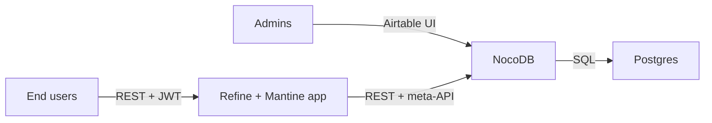
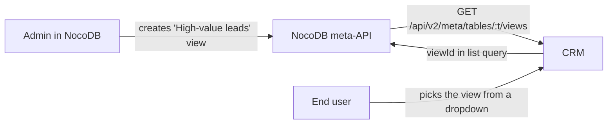

# Elemental ERP

> Modular open-source ERP that starts with CRM. Admins build new tables and
> views in an Airtable-style schema editor; end users get a clean, opinionated
> CRM frontend on top. One `docker compose up` from clone to running.

Built on:

- [NocoDB](https://nocodb.com/) — the schema/data backbone and Airtable-style admin UI
- [Refine.dev](https://refine.dev/) + [Mantine](https://mantine.dev/) — the curated end-user CRM
- Postgres, Caddy, Docker Compose



## Why this exists

Most "build your own ERP" projects fall into one of two traps: they're
either rigid (shipping a fixed schema you can't bend without forking) or
all-power-tool (Airtable / NocoDB raw, no end-user opinion). This repo
splits the difference:

- **Admins** open the Schema Builder (NocoDB) and click their way to new
  tables, fields, relations, views, kanban columns. No code, no migrations.
- **End users** never see NocoDB. They use a polished CRM with dashboards,
  drag-and-drop pipelines, kanban boards, and timelines.
- **Modules** are folders under `packages/modules/`. Drop one in,
  rebuild, done. V1 ships only `crm`; the same shape supports inventory,
  manufacturing, support, etc.

## 60-second quickstart

```bash
# 1. clone
git clone <this repo>
cd elemental-erp

# 2. env
cp infra/.env.example .env
# edit .env: domains, ADMIN_EMAIL/PASSWORD, NC_AUTH_JWT_SECRET, POSTGRES_PASSWORD

# 3. up
docker compose -f infra/docker-compose.yml --env-file .env up -d
```

When the `seed` container exits cleanly (about 60-90s after first boot) you can:

- Visit `https://${CRM_DOMAIN}` and log in with `ADMIN_EMAIL` / `ADMIN_PASSWORD`.
- Visit `https://${ADMIN_DOMAIN}` for the NocoDB Schema Builder.

The seed creates the `Elemental` base, all five CRM tables (Companies,
Contacts, Deals, Activities, Tasks) with relations and starter views, and
(if `DEMO_DATA=true` in the env) a handful of demo records.

For local development without HTTPS, run NocoDB and Postgres in containers
and the frontend locally:

```bash
pnpm install
docker compose -f infra/docker-compose.yml up -d postgres nocodb
NOCODB_URL=http://localhost:8080 pnpm seed
NOCODB_URL=http://localhost:8080 pnpm demo:seed   # optional
pnpm --filter @elemental/crm-app dev
```

The Vite dev server runs at `http://localhost:5173`.

## Repo layout

```
apps/
  crm/                # Refine.dev end-user UI
packages/
  sdk/                # ErpModule contract + typed NocoDB client
  ui/                 # shared Mantine theme + small components
  modules/
    crm/              # CRM module: schema + resources + nav
infra/
  docker-compose.yml  # postgres + nocodb + crm + caddy + seed
  Caddyfile
  Dockerfile.crm
  nginx-crm.conf
  .env.example
scripts/
  seed.ts             # idempotent NocoDB schema bootstrap
  demo-data.ts        # idempotent demo records
  backup.sh           # pg_dump + NocoDB meta export
```

## Module contract

Every module exports an `ErpModule` from its `index.ts`:

```ts
import { defineModule } from '@elemental/sdk';
import { schema } from './schema';
import { resources } from './resources';
import { navigation } from './navigation';

export const myModule = defineModule({
  id: 'inventory',
  name: 'Inventory',
  version: '0.1.0',
  schema,        // tables, fields, relations, views (created via NocoDB meta-API)
  resources,     // Refine resources (list/show/create/edit pages)
  navigation,    // sidebar items
});
```

Adding a module:

1. `mkdir packages/modules/inventory && cd $_` and write `package.json` + `src/index.ts`.
2. Push it onto the array in `apps/crm/src/modules.ts`.
3. `pnpm seed` to apply its schema, then `docker compose up --build crm`.

## Custom views (the Airtable-style superpower)

Admins can create new NocoDB views (Grid / Kanban / Form / Calendar) on any
table at any time. The end-user CRM picks them up automatically: the view
selector at the top of every list page reads NocoDB's view metadata and
asks NocoDB to apply that view's columns, filter, and sort server-side.



No redeploys. No code. The same idea will power "saved searches" on every
future module.

## Roles

NocoDB owns identity. We map its workspace roles to three app-level roles:

| App role  | Comes from NocoDB | Sees                                |
|-----------|-------------------|-------------------------------------|
| admin     | super / owner / creator | everything + Schema Builder + Users |
| manager   | editor            | full CRUD on data                   |
| user      | commenter / viewer| read all, create + edit own         |

Use the **Users** page (admin only) to invite teammates with a role.

## Backups

```bash
NOCODB_API_TOKEN=... POSTGRES_USER=elemental POSTGRES_DB=elemental \
  ./scripts/backup.sh ./backups
```

Produces `backups/elemental-backup-<timestamp>.tar.gz` containing a
`pg_dump` plus a NocoDB meta export.

## Roadmap

- Inventory, Manufacturing, Purchasing modules (port from the legacy
  Meteor app archived in this repo).
- Audit-log module (NocoDB webhooks → append-only `audit_log` table).
- Light Make/Zapier-style automations.
- Email integration for activity sync.
- Per-tenant SaaS deployment.

## License

GPLv3 (see [LICENSE](LICENSE)). Note that NocoDB's enterprise/cloud
features are AGPL — this is fine for self-hosted deployments at customers.
If you want to ship Elemental as a managed SaaS without releasing
modifications, swap NocoDB for a permissively-licensed alternative
(Directus, Baserow OSS) — the architecture is identical.

---

The legacy Meteor 1.5 prototype that originated this project is preserved
in `client/`, `server/`, `lib/`, and `.meteor/` for archival reference.
See the original `README` (`git show HEAD~:README.md`) for that history.
